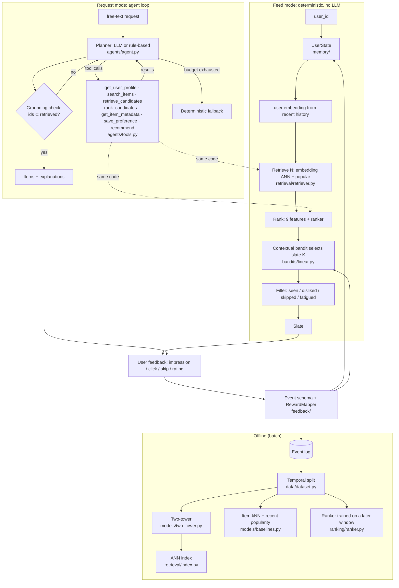
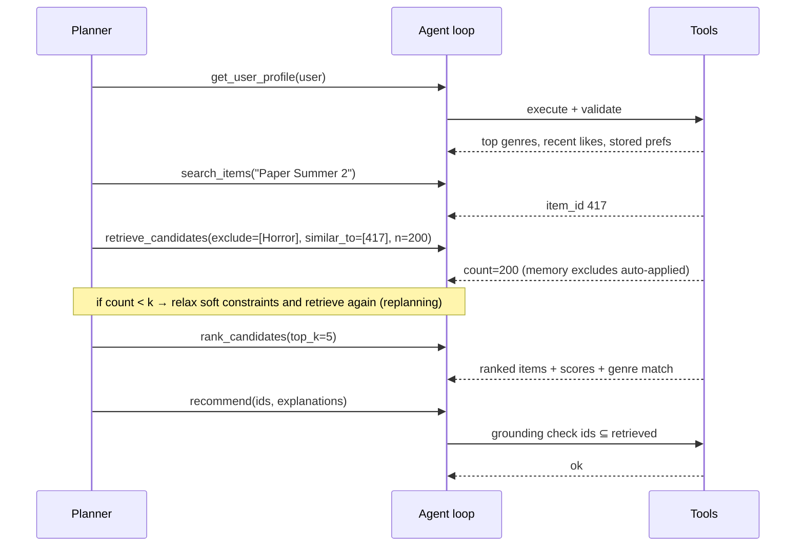

# ARCHITECTURE.md

AgentRec has **two request paths that share one set of components**:

- **Feed mode.** There is no user request: *"show me my home feed"*. This path is a deterministic
  pipeline and runs in milliseconds.
- **Request mode.** The user types something: *"like Heat but no romance"*. This path runs a bounded
  agent loop that calls the same components as tools.

## Why it is shaped this way

This section explains the departures from the "agent on top of everything" sketch.

1. **The agent does not sit above the feed.** A feed request carries no intent to interpret, and its
   steps never change. An LLM there would add seconds of latency and per-call cost for no measured
   gain. See D19.
2. **The bandit acts after the ranker, over its top N.** Exploration happens only among relevant
   candidates, and the ranker score is a feature with a prior mean θ₀ that reproduces the ranker's
   order. Caveat: this warm start fully holds for greedy only. LinUCB's bonus and LinTS's sampling
   dominate the small prior at t = 0 unless λ is large (EXPERIMENTS E4/E6). The serving path is
   `bandits/env.py::serve_slate`, which the demo's feed uses.
3. **Retrieval exists because ranking every item does not scale.** E2 extrapolates brute-force cost
   to 10M items. E3's no-retrieval ablation measures the cost here.
4. **Hard constraints are enforced in code, not in prompts.** Stated excludes, dislikes and seen
   items are filtered inside `retrieve_candidates`, and grounding is checked inside `recommend`.
5. **Two learners run on two timescales.** The user state changes on every event (instant, per
   user). The bandit's (A, b) statistics update online (global). The towers and ranker retrain
   offline.

## Request-mode sequence (one real trajectory)

This is the path for *"something like Paper Summer 2 but no Horror"* with the rule-based planner:

## Module map

| path | responsibility | key types |
|---|---|---|
| `data/movielens.py` | read ML-1M `.dat` files, validate them | `RawData` |
| `data/synthetic.py` | synthetic data generator in ML-1M format | `SyntheticConfig` |
| `data/dataset.py` | ID mapping, implicit conversion, temporal split | `Dataset`, `Period` |
| `models/base.py` | scorer contract + cold-user fallback | `Recommender` |
| `models/baselines.py` | popularity, recent popularity, content, item-kNN | |
| `models/mf_bpr.py` | BPR matrix factorisation | `BPRMF` |
| `models/two_tower.py` | two-tower, in-batch softmax, hand-written backprop | `TwoTower` |
| `retrieval/index.py` | exact / IVF / FAISS indexes | `ExactIndex`, `IVFIndex` |
| `retrieval/retriever.py` | multi-source candidates, hard filters | `CandidateRetriever`, `Candidates` |
| `ranking/ranker.py` | ranking features + pointwise / pairwise / GBDT rankers | `FeatureBuilder`, `Ranker` |
| `pipeline.py` | stage-1 fitting + feed pipeline | `Stage1`, `FeedPipeline` |
| `bandits/mab.py` | ε-greedy, UCB1, Thompson (non-contextual) | |
| `bandits/linear.py` | ridge state, LinUCB, LinTS, ε-greedy, frozen, random | `RidgeState` |
| `bandits/simulator.py` | PBM user simulator, truth model | `Simulator`, `TruthModel` |
| `bandits/env.py` | context vectors, slate experiment loop | `BanditEnv` |
| `feedback/events.py` | event schema, reward mapping | `Event`, `RewardMapper` |
| `feedback/loop.py` | events → state update → policy update | `FeedbackLoop` |
| `memory/user_state.py` | per-user preference state | `UserState` |
| `memory/store.py` | SQLite event log + state | `MemoryStore` |
| `llm/client.py` | OpenAI-compatible client, scripted LLM for tests | `OpenAICompatClient` |
| `llm/rule_based.py` | deterministic planner, hallucination stress planner | `RuleBasedPlanner` |
| `agents/intent.py` | structured constraints + regex parser | `Constraints` |
| `agents/tools.py` | tool implementations, schemas, validation, guardrails | `RecTools`, `Session` |
| `agents/agent.py` | bounded agent loop + fallback | `RecAgent`, `AgentResult` |
| `evaluation/metrics.py` | Precision, Recall, NDCG, MRR, MAP, Hit | |
| `evaluation/evaluator.py` | full-ranking evaluation with slices | `evaluate_model` |
