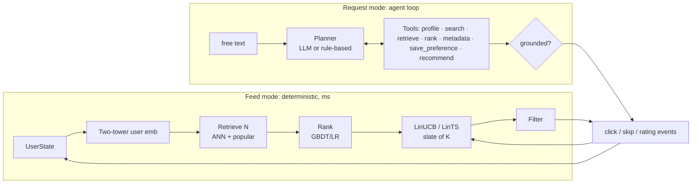

# AgentRec

A two-stage recommender (two-tower retrieval + learned ranker) with contextual-bandit exploration,
an event-driven feedback loop, and a tool-calling agent for free-text requests. It's built from first
principles in NumPy: the two-tower gradients, the ANN index and the bandits are all written by hand
and tested.

> **Status: honest summary.**
> - The code is complete and tested: 59 tests, plus one script that reproduces every experiment.
> - The results committed in `results/synthetic/` come from a **synthetic dataset in MovieLens-1M
>   format**. The build machine had no internet, so MovieLens couldn't be downloaded. **They are not
>   MovieLens results.**
> - To produce real results, run `bash scripts/run_all.sh configs/ml1m.yaml` after downloading
>   ML-1M (see [data/README.md](data/README.md)).
> - All bandit and feedback-loop numbers come from a **user simulator**.
> - The agent's offline evaluation uses a **rule-based planner**. The loop is designed so that an
>   OpenAI-compatible LLM (for example a local Ollama model) plugs in via `--llm`. That client has
>   **not been tested against a live endpoint** yet.

---

## 1. Overview and motivation
A recommender that only fits yesterday's logs has three blind spots:
- It never learns about items it doesn't show. **Exploration** addresses this.
- It doesn't react to what the user just did. The **feedback loop** addresses this.
- It can't take instructions like *"something like Heat, but no romance"*. **Request mode**
  addresses this.

AgentRec adds each of these on top of a conventional, well-evaluated two-stage recommender. It is
explicit about where an LLM or agent helps and where it would only add cost.

## 2. Problem definition
- **Feed mode:** given a user and their history, return a slate of K items that maximises expected
  engagement (clicks, ratings). Keep learning from the feedback.
- **Request mode:** given a user and a free-text request, return K items that satisfy its hard
  constraints, respect stored preferences, come only from the real catalogue, and fit the user's
  taste. Each item comes with an explanation.

## 3. Architecture
Two request paths share the same retrieval and ranking code. The full diagram and module map are in
[ARCHITECTURE.md](ARCHITECTURE.md).



## 4. Dataset
- **Target:** MovieLens-1M (6,040 users, 3,883 movies listed / 3,706 rated, 1M ratings, timestamps, genres, titles).
- **Development (committed results):** a synthetic dataset in the same file format. 3,000 users,
  2,000 items, about 200k ratings, with exposure bias built in (popular and liked items are more
  likely to be rated, i.e. missing not at random). See `src/agentrec/data/synthetic.py`.
- **Protocol:**
  - A rating ≥ 4 counts as a positive.
  - **Global temporal split** at the 80th and 90th timestamp percentiles.
  - Tune on val; refit on train+val; report test.
  - Full-catalogue ranking (no sampled negatives).

## 5. Methodology

| stage | what | file |
|---|---|---|
| Retrieval | two-tower: history-based user tower (residual MLP), item tower = ID + genres; in-batch softmax with logQ correction; hand-derived backprop, gradient-checked | `models/two_tower.py` |
| ANN | exact MIPS, own IVF (k-means lists, n_probe), optional FAISS | `retrieval/index.py` |
| Candidates | 90% embedding ANN + 10% recent-popular; hard filters applied inside retrieval | `retrieval/retriever.py` |
| Ranking | 9 features (retrieval score and rank, item-kNN score, popularity, recency, genre match, age, activity, source); pointwise LR / pairwise LR / GBDT; trained on a later window than stage 1 | `ranking/ranker.py` |
| Contextual bandit | shared-parameter LinUCB, LinTS, ε-greedy over the ranker's top 50; prior mean θ₀ = ranker order; Sherman–Morrison updates; position-as-feature debiasing; serving path `bandits/env.py::serve_slate` | `bandits/` |
| Feedback loop | immutable events → RewardMapper → UserState (history, dislikes, skip/fatigue blocks, genre EMA) → bandit (A, b) | `feedback/`, `memory/` |
| LLM | client for the OpenAI-compatible tool-calling API (Ollama, vLLM, OpenAI…); **not tested against a live endpoint here**; no LLM on the feed path | `llm/client.py` |
| Agent | bounded loop; 7 tools with JSON schemas; argument validation; grounding check (only ids retrieved in this session); memory excludes enforced in code; relaxation / replanning; deterministic fallback | `agents/` |

**What makes it agentic, and what doesn't.** Request mode lets the planner choose tool calls at run
time. It looks up a title only if one is mentioned, saves a preference only if one is stated, and
re-retrieves with relaxed constraints when too few items match. Feed mode is deliberately a fixed
pipeline. The offline planner is rule-based, so the agentic claim is strongest with `--llm`. See
[LEARNING_NOTES §9](LEARNING_NOTES.md) and [DESIGN_DECISIONS](DESIGN_DECISIONS.md).

## 6. Results
See **[EXPERIMENTS.md](EXPERIMENTS.md)** for every table, the protocols, and an interpretation that
includes the negative results. Raw outputs are in `results/<dataset>/`.


## 7. Installation
```bash
python -m venv .venv && source .venv/bin/activate
pip install -r requirements.txt      # numpy, pandas, scipy, scikit-learn, pyyaml, matplotlib, httpx, pytest
pytest -q                            # 59 tests
```

## 8. Usage
```bash
# synthetic (no download needed)
bash scripts/run_all.sh configs/synthetic.yaml

# MovieLens-1M: unzip ml-1m into data/raw/ml-1m/ first
bash scripts/run_all.sh configs/ml1m.yaml

# individual experiments
python scripts/run_baselines.py configs/ml1m.yaml     # E1
python scripts/run_ranking.py   configs/ml1m.yaml     # E3 (trains + caches stage 1 and the ranker)
python scripts/run_retrieval.py configs/ml1m.yaml     # E2
python scripts/run_bandits.py   configs/ml1m.yaml     # E4–E6 (simulated)
python scripts/run_agent_eval.py configs/ml1m.yaml [--llm http://localhost:11434/v1 qwen2.5:7b-instruct]
python scripts/run_latency.py   configs/ml1m.yaml

# interactive demo: feed, free-text requests, click/skip/rate
python scripts/demo.py configs/ml1m.yaml [--llm http://localhost:11434/v1 qwen2.5:7b-instruct]
```

## 9. Example interaction (real transcript: `scripts/demo.py`, rule-based planner, synthetic data)
```
[user 0]> ask something like Paper Summer 2 but no Horror
  tool calls: get_user_profile -> search_items -> retrieve_candidates -> rank_candidates -> recommend
  0. Savage Circus 2 (1992)  — genres Comedy; taste match 0.0; close to Paper Summer 2 (1975) in embedding space
  ...
[user 0]> ask I hate drama. give me 3 movies
  tool calls: get_user_profile -> save_preference -> retrieve_candidates -> rank_candidates -> recommend
  0. Hollow River 4 (1987)  — genres Thriller; taste match 1.0
  ...
[user 0]> feed                      # stored "no Drama" is enforced in code in feed mode too: none of the 10 items is Drama
[user 0]> ask Comedy movies from the 30s, hidden gems
  tool calls: get_user_profile -> retrieve_candidates -> retrieve_candidates -> retrieve_candidates -> rank_candidates -> recommend
  0. Silent Orchard (1991)  — genres Comedy, Thriller; taste match 0.71; less-known pick; too few exact matches, relaxed: popularity, year
```
The last request shows **replanning**. Too few 1930s long-tail comedies existed, so the planner
relaxed the soft constraints one at a time and told the user it had done so. The hard constraint
(the stored Drama exclusion) is never relaxed.

## 10. Limitations
- The committed numbers are **synthetic**. MovieLens numbers need one command on your machine.
- The bandit and feedback results come from a **simulator**:
  - Its truth is the generator's latent factors (synthetic) or a BPR model fit on all data
    (MovieLens), which is a proxy.
  - Feedback is immediate and rewards are stationary.
- The rule-based planner is not an LLM. LLM planning is implemented but was not evaluated here.
- The architecture is small: a one-hidden-layer tower, a linear bandit, and slates chosen as
  independent picks.
- The numpy IVF and the Python feature code are slower than production libraries (see latency).

## 11. Future work
- Real ML-1M runs.
- An LLM planner evaluated on messy requests.
- A sequence user tower (SASRec).
- IPS / doubly-robust off-policy evaluation.
- KuaiRec's fully observed matrix for bandit evaluation.
- Slate-aware bandits.
- Delayed feedback.

## 12. Reproducibility
- Every script is seeded and reads one YAML config.
- `scripts/run_all.sh` regenerates every table and figure from raw files.
- A fresh clone reproduced the committed synthetic results (see the EXPERIMENTS.md header).

## Learning materials
[LEARNING_NOTES](LEARNING_NOTES.md) (the course) · [exercises/](exercises/) ·
[INTERVIEW_PREP](INTERVIEW_PREP.md) · [DESIGN_DECISIONS](DESIGN_DECISIONS.md) ·
[PROJECT_AUDIT](PROJECT_AUDIT.md) · [RESUME](RESUME.md) · [SELF_STUDY_PLAN](SELF_STUDY_PLAN.md)
