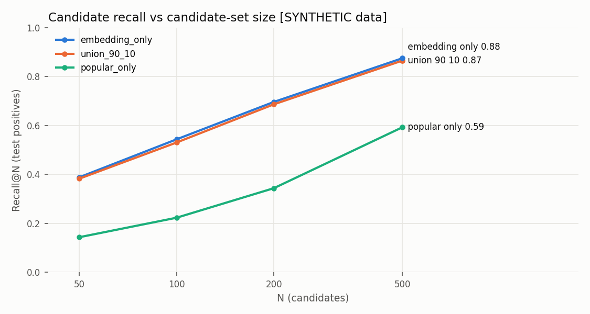
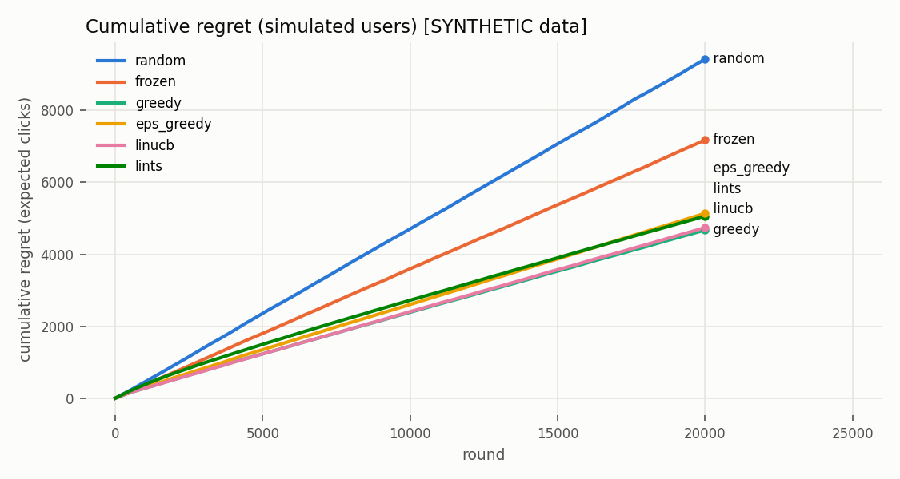
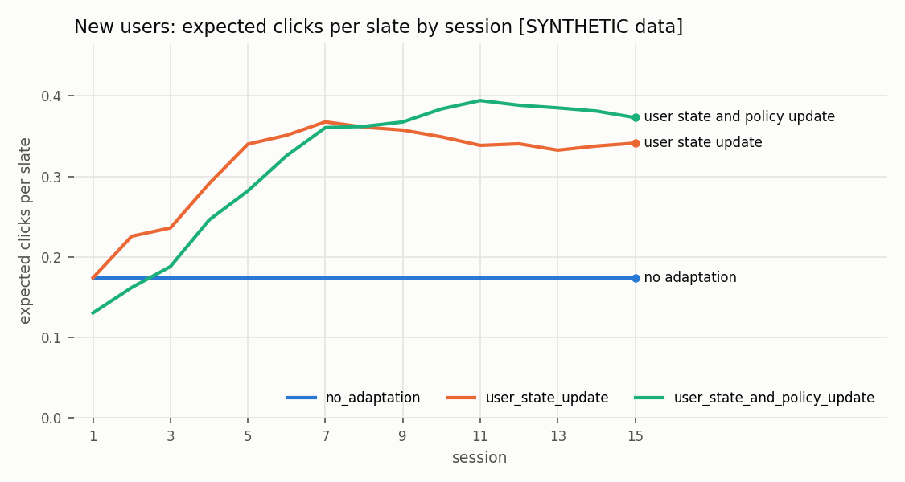

# All results: `synthetic`


**SYNTHETIC DATA: not MovieLens results.**


## Data

```json
{
  "n_users": 3000,
  "n_items": 2000,
  "n_ratings": 200982,
  "density": 0.033497,
  "frac_positive": 0.54483983640326,
  "train_ratings": 160785,
  "train_users": 2791,
  "val_ratings": 20098,
  "val_users": 1039,
  "test_ratings": 20099,
  "test_users": 830,
  "test_users_cold": 59,
  "test_positive_pairs_on_cold_items": 361
}
```


# E1 — baselines on `synthetic` (TEST, full ranking)

users evaluated: 805

| model | config | ndcg@10 | recall@10 | precision@10 | mrr@10 | map@10 | recall@50 | ndcg@50 | warm ndcg@10 | sparse ndcg@10 | cold ndcg@10 | tail recall@10 | coverage@10 | mean pop pct@10 | fit s |
|---|---|---|---|---|---|---|---|---|---|---|---|---|---|---|---|
| popularity | - | 0.0564 | 0.0404 | 0.0476 | 0.1329 | 0.0224 | 0.1333 | 0.0883 | 0.0493 | 0.0779 | 0.0907 | 0.0000 | 0.016 | 0.003 | 0.0 |
| recent_popularity | half_life_days=90 | 0.0681 | 0.0506 | 0.0528 | 0.1634 | 0.0286 | 0.1451 | 0.0991 | 0.0642 | 0.0775 | 0.0911 | 0.0000 | 0.015 | 0.034 | 0.0 |
| content | decade_weight=0.0 | 0.0805 | 0.0504 | 0.0749 | 0.1603 | 0.0367 | 0.2176 | 0.1377 | 0.0828 | 0.0611 | 0.0907 | 0.0363 | 0.705 | 0.399 | 0.0 |
| itemknn | k=200 | 0.2141 | 0.1328 | 0.1796 | 0.4024 | 0.1217 | 0.3450 | 0.2630 | 0.2348 | 0.1641 | 0.0907 | 0.0143 | 0.267 | 0.072 | 0.1 |
| bpr_mf | reg=0.002, dim=64 | 0.2083 | 0.1302 | 0.1738 | 0.3999 | 0.1147 | 0.3461 | 0.2619 | 0.2253 | 0.1765 | 0.0907 | 0.0157 | 0.379 | 0.078 | 30.4 |
| two_tower | reg=0.0001, dim=64, tau=0.1 | 0.2123 | 0.1357 | 0.1768 | 0.4008 | 0.1179 | 0.3719 | 0.2724 | 0.2310 | 0.1728 | 0.0907 | 0.0278 | 0.329 | 0.118 | 167.2 |


# E2 — retrieval on `synthetic` (TEST positives, warm users=742, cold=63)

| N | embedding only | popular only | union (90/10) | cold users (popular) |
|---|---|---|---|---|
| 50 | 0.3883 | 0.1431 | 0.3825 | 0.1780 |
| 100 | 0.5435 | 0.2228 | 0.5305 | 0.2846 |
| 200 | 0.6964 | 0.3436 | 0.6867 | 0.4156 |
| 500 | 0.8753 | 0.5929 | 0.8657 | 0.6187 |

| index | ANN recall@100 vs exact | items scanned | p50 ms | p95 ms |
|---|---|---|---|---|
| exact | 1.000 | 1.000 | 0.031 | 0.047 |
| ivf_nlist64_nprobe1 | 0.354 | 0.016 | 0.033 | 0.056 |
| ivf_nlist64_nprobe2 | 0.543 | 0.031 | 0.036 | 0.060 |
| ivf_nlist64_nprobe4 | 0.722 | 0.062 | 0.038 | 0.072 |
| ivf_nlist64_nprobe8 | 0.866 | 0.125 | 0.042 | 0.079 |
| ivf_nlist64_nprobe16 | 0.958 | 0.250 | 0.086 | 0.166 |
| ivf_nlist64_nprobe32 | 0.995 | 0.500 | 0.140 | 0.229 |

Brute-force dot product: 9.20 ns/item measured -> ~92 ms/query at 10M items (EXTRAPOLATED).


# E3 — ranking on `synthetic` (TEST, warm users=742, N=200 candidates)

Chosen on held-out VAL users: **gbdt**

| ranker | holdout-VAL ndcg@10 | TEST ndcg@10 | recall@10 | mrr@10 | map@10 | recall@50 | p50 ms/request |
|---|---|---|---|---|---|---|---|
| identity | 0.1979 | 0.2226 | 0.1422 | 0.4163 | 0.1249 | 0.3883 | 1.3 |
| pointwise | 0.2014 | 0.2426 | 0.1567 | 0.4473 | 0.1395 | 0.3969 | 1.5 |
| pairwise | 0.2000 | 0.2407 | 0.1549 | 0.4461 | 0.1379 | 0.3961 | 1.6 |
| gbdt | 0.2138 | 0.2395 | 0.1535 | 0.4396 | 0.1375 | 0.3970 | 3.1 |

Candidate-size ablation (gbdt ranker)

| N | ndcg@10 | recall@50 | p50 ms | p95 ms |
|---|---|---|---|---|
| 50 | 0.2460 | 0.3825 | 2.3 | 3.6 |
| 100 | 0.2422 | 0.3951 | 2.8 | 4.4 |
| 200 | 0.2395 | 0.3970 | 3.0 | 4.4 |
| 500 | 0.2340 | 0.3909 | 4.9 | 5.9 |

No-retrieval ablation (300 users): rank whole catalogue ndcg@10=0.1922, p50=8.4 ms  vs  retrieval N=200: ndcg@10=0.2168

Pointwise LR coefficients (standardised features): {'retrieval_score': 0.4564, 'retrieval_rank': -0.434, 'itemknn_score': 0.1913, 'log_pop': -0.1938, 'log_recent_pop': 0.4068, 'genre_match': 0.1535, 'item_age': -0.0542, 'log_user_activity': -0.0467, 'from_popular_source': 0.0043}


# E4–E6 — bandits & feedback on `synthetic` — ALL NUMBERS FROM THE SIMULATOR

truth: synthetic generator latents; 500 warm users; slate K=5 from top-50 ranked candidates; T=20000 rounds; examination probs [1.0, 0.616, 0.463, 0.379, 0.324].

**Seeds:** E4 and E4b use 3 seeds [0, 1, 2]; E4c, E4c', E5 and E6 use 2 seeds [0, 1], so the same configuration can show slightly different numbers across sections.

## E4a toy 10-armed Bernoulli bandit (T=5000, 20 seeds)

| policy | final regret (mean ± sd) |
|---|---|
| eps_greedy_0.1 | 180.3 ± 102.1 |
| ucb1 | 349.9 ± 27.3 |
| thompson | 101.9 ± 26.2 |

## E4 slate policies (position-as-feature updates, 3 seeds)

| policy | cum. regret (mean ± sd) | exp. clicks/slate | exp. clicks/slate (last 25%) | exploration rate |
|---|---|---|---|---|
| random | 9418.3 ± 6.7 | 0.2758 | 0.2786 | 0.980 |
| frozen | 7177.1 ± 21.7 | 0.3945 | 0.3916 | 0.000 |
| greedy | 4672.8 ± 189.1 | 0.5197 | 0.5238 | 0.000 |
| eps_greedy | 5136.3 ± 76.7 | 0.4996 | 0.5120 | 0.256 |
| linucb | 4740.1 ± 66.1 | 0.5163 | 0.5180 | 0.091 |
| lints | 5061.2 ± 83.4 | 0.4998 | 0.5236 | 0.724 |

## E4b position-bias handling (LinUCB, 3 seeds)

| update mode | cum. regret (mean ± sd) | exp. clicks/slate |
|---|---|---|
| naive | 5570.5 ± 136.1 | 0.4748 |
| position_feature | 4740.1 ± 66.1 | 0.5163 |
| oracle_examined | 4496.5 ± 62.1 | 0.5285 |

## E4c LinUCB alpha (2 seeds)

| alpha | cum. regret (mean ± sd) | exploration rate |
|---|---|---|
| 0.1 | 4869.3 ± 177.8 | 0.011 |
| 0.5 | 4653.2 ± 60.4 | 0.049 |
| 1.0 | 4753.0 ± 77.8 | 0.091 |
| 2.0 | 4735.5 ± 19.0 | 0.141 |

## E4c' LinTS posterior scale v (2 seeds)

| v | cum. regret (mean ± sd) | exploration rate |
|---|---|---|
| 0.05 | 4617.6 ± 55.1 | 0.186 |
| 0.1 | 4614.6 ± 9.6 | 0.295 |
| 0.2 | 4617.7 ± 62.4 | 0.472 |
| 0.5 | 5005.4 ± 32.9 | 0.721 |

## E6 noisy feedback (observed click label flipped with prob p; 2 seeds; mean ± sd)

| p | frozen | greedy | linucb (λ=1) | linucb (λ=100, stronger prior) |
|---|---|---|---|---|
| 0.0 | 7166.0 ± 18.4 | 4711.4 ± 221.8 | 4753.0 ± 77.8 | 4370.4 ± 63.1 |
| 0.1 | 7166.0 ± 18.4 | 4893.0 ± 184.5 | 4812.6 ± 34.7 | 4680.1 ± 240.7 |
| 0.2 | 7166.0 ± 18.4 | 5489.6 ± 133.1 | 5583.8 ± 228.8 | 5022.9 ± 155.8 |
| 0.3 | 7166.0 ± 18.4 | 7017.4 ± 1565.6 | 5834.4 ± 345.4 | 5433.2 ± 290.4 |

## E5 new users, 15 sessions each (200 users, history hidden; 2 seeds)

Arms: `no_adaptation` = ranker top-K, state never updated; `user_state_update` = ranker top-K + user-state updates; `user_state_and_policy_update` = **LinUCB slate selection** + user-state + policy updates (two changes vs the previous arm).

| condition | exp. clicks session 1 | session last | mean over sessions |
|---|---|---|---|
| no_adaptation | 0.1740 | 0.1740 | 0.1740 |
| user_state_update | 0.1740 | 0.3414 | 0.3162 |
| user_state_and_policy_update | 0.1303 | 0.3730 | 0.3153 |


# E8 — request mode on `synthetic` (1050 templated requests + 150 memory follow-ups = 1200 turns per system, 150 users, k=5)

`agent_rule` = agent loop + tools + memory + guardrails, driven by a RULE-BASED planner (not an LLM). `agent_halluc` = same, but the first `recommend` call of every turn contains one out-of-catalogue item id injected by the test harness.

Columns: *valid & unseen* = every returned id exists in the catalogue and was not already seen by the user (membership in the retrieved set is enforced separately by the `recommend` tool). Rates are per returned item, except *filled k* (per turn).

| system | filled k | hard-constraint violations | soft constraints met | valid & unseen | taste sim. | p50 ms | tool calls | turns replanned | fallbacks | ungrounded ids rejected | schema errors |
|---|---|---|---|---|---|---|---|---|---|---|---|
| feed | 1.000 | 0.007 | 0.715 | 1.000 | 0.523 | 2.8 | 0.0 | 0 | 0 | 0 | 0 |
| fixed | 0.967 | 0.002 | 0.987 | 1.000 | 0.478 | 3.4 | 0.0 | 0 | 0 | 0 | 0 |
| agent_rule | 1.000 | 0.000 | 0.967 | 1.000 | 0.484 | 4.4 | 4.4 | 40 | 0 | 0 | 0 |
| agent_halluc | 1.000 | 0.000 | 0.967 | 1.000 | 0.484 | 4.7 | 5.4 | 40 | 0 | 1200 | 0 |

Per request type — soft constraints met / hard violations / filled:

| type | feed | fixed | agent_rule | agent_halluc |
|---|---|---|---|---|
| genre | 0.75 / 0.00 / 1.00 | 1.00 / 0.00 / 1.00 | 1.00 / 0.00 / 1.00 | 1.00 / 0.00 / 1.00 |
| genre_decade | 0.10 / 0.00 / 1.00 | 0.89 / 0.00 / 0.73 | 0.74 / 0.00 / 1.00 | 0.74 / 0.00 / 1.00 |
| genre_exclude | 0.75 / 0.01 / 1.00 | 1.00 / 0.00 / 1.00 | 1.00 / 0.00 / 1.00 | 1.00 / 0.00 / 1.00 |
| hidden_gems | 0.11 / 0.00 / 1.00 | 1.00 / 0.00 / 1.00 | 1.00 / 0.00 / 1.00 | 1.00 / 0.00 / 1.00 |
| memory | 1.00 / 0.01 / 1.00 | 1.00 / 0.00 / 1.00 | 1.00 / 0.00 / 1.00 | 1.00 / 0.00 / 1.00 |
| memory_followup | 1.00 / 0.01 / 1.00 | 1.00 / 0.01 / 1.00 | 1.00 / 0.00 / 1.00 | 1.00 / 0.00 / 1.00 |
| similar | 1.00 / 0.00 / 1.00 | 1.00 / 0.00 / 1.00 | 1.00 / 0.00 / 1.00 | 1.00 / 0.00 / 1.00 |
| similar_exclude | 1.00 / 0.01 / 1.00 | 1.00 / 0.00 / 1.00 | 1.00 / 0.00 / 1.00 | 1.00 / 0.00 / 1.00 |


# Latency on `synthetic` (2000 items, N=200 candidates, 300 requests, single process, CPU)

| stage (total = embed+retrieve+features+rank) | exact p50 ms | exact p95 ms | IVF p50 ms | IVF p95 ms |
|---|---|---|---|---|
| user_embedding | 0.058 | 0.119 | 0.056 | 0.107 |
| retrieval | 0.449 | 0.666 | 0.525 | 0.750 |
| features | 0.482 | 0.728 | 0.472 | 0.626 |
| ranker | 1.740 | 2.521 | 1.778 | 2.981 |
| bandit | 0.432 | 0.606 | 0.438 | 0.564 |
| total | 2.753 | 3.902 | 2.879 | 4.862 |

Throughput estimate (1000 / mean latency of total + bandit, sequential, exact): 293 req/s. Not a load test. `bandit` times only `select()` on a prebuilt context matrix; building the context re-uses retrieval + ranking.

Agent request (rule-based planner): p50 4.4 ms, p95 5.9 ms, 4.0 tool calls. planner is rule-based; a real LLM adds (#llm_calls x LLM latency), typically seconds.

Memory (MB): item_embeddings=1.02, two_tower_params=2.12, itemknn_similarity_sparse=1.51









